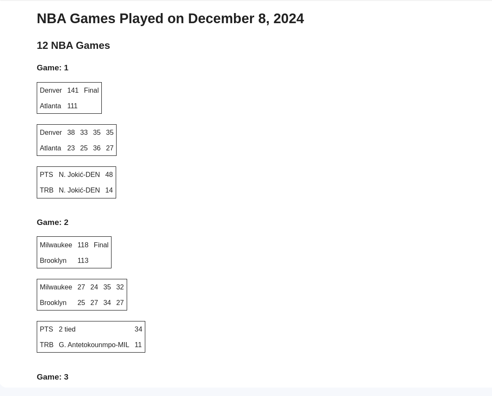

# spots-results-notifier

Learned about:
1. The ability to harvest data from non-api sources (Web scrapping)
2. The ability to send e-mails

How it looks in the email inbox:

Resources:
[Agility Pack Docs](https://html-agility-pack.net/)
[Send An Email Using Gmail SMTP and C#](https://www.c-sharpcorner.com/blogs/send-email-using-gmail-smtp)
[How to Fix Less Secure App Access Problem in Gmail | Alternative Solution for Less Secure App](https://www.youtube.com/watch?v=Gu4ifdBkrNM) (Search app in the search bar to find app passwords)
[Agility Pack Tutorial](https://www.youtube.com/watch?v=oMM0yzyi4Do)
[Another Agility Pack Tutorial](https://www.youtube.com/watch?v=wbBuB7-BaXw)
[Basketball Reference](https://www.basketball-reference.com/boxscores/)
[Papercut - Use it for local Email SMTP testing](https://github.com/ChangemakerStudios/Papercut-SMTP)

